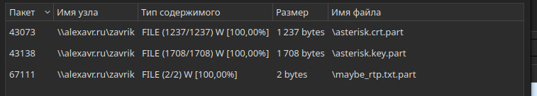

# White Rabbit | Forensics

## Информация
> Если бы Морфеус занимался таким в матрице, Нео бы никогда из нее не вышел.

## Файл задания
[task.zip](https://polyctf.qookie.tech/WhiteRabbit/task.zip)

## Описание
Перевести udp запросы в rtp, затем в одной из дорожек будет виден шум в сочетании со звуком. Эту дорожку экспортировать и просмотреть спектрограмму, в ней можно увидеть флаг.

## Решение
Участника предоставляется дамп сетевого трафика output.pcap. В первую очередь можно посмотреть на иерархию протоколов.


Можно обратить внимание на то, что почти весь трафик занимают UDP-пакеты. Значит, можно сделать вывод о передаче массивного объема данных. Кроме этого, присутствуют протоколы для работы с файловым сервером SMB.
Попробуем экспортировать файлы из потока SMB:



Видно, что передаются некие ключи asterisk.* и файл maybe_rtp.part. Ключ и сертификат действительно содержат данные, а вот файл оказался пустой. 
Asterisk - это сервер VoIP, для использования IP-телефонии. Возможно, трафик содержит записи переговоров. Однако при попытке просмотра потока VoIP данных не окажется из-за того, что трафик звонков скорее всего передавался с использованием TLS протокола, что тоже можно заметить в иерархии протоколов.

Попробуем расшифровать TLS трафик, используя ключ и samba-трафика. Скорее всего, ничего не выйдет, т.к. в трафике нет TLS-handshake-ов. Однако сами медиаданные передаются с помощью обычного RTP-трафика, (по факту просто UDP пакетов). На это намекает большое количество таких пакетов и название одного из файлов.

Чтобы посмотреть RTP-поток, необходимо декодировать по возможности все UDP пакеты как RTP.
Отфильтруем их:
```
udp && !rtp && !rtcp && !quic
```

После этого во вкладке “Телефония” можно отследить все RTP Потоки. Если выделить их все, то при Воспроизведении можно увидеть четкие 3 дорожки со спамерскими звонками. При этом Последняя содержит явные шумы и вид аудио отличается от записи обычного голоса.


Этот поток можно экспортировать как .wav, а затем просмотреть его спектрограмму (к примеру, в audacity). В ней будет находится флаг.


## Флаг
`NQ2024d594d3a584cc523ec56a5413c87a1d23f3a6b96b875af64164954dbd38404d21`
